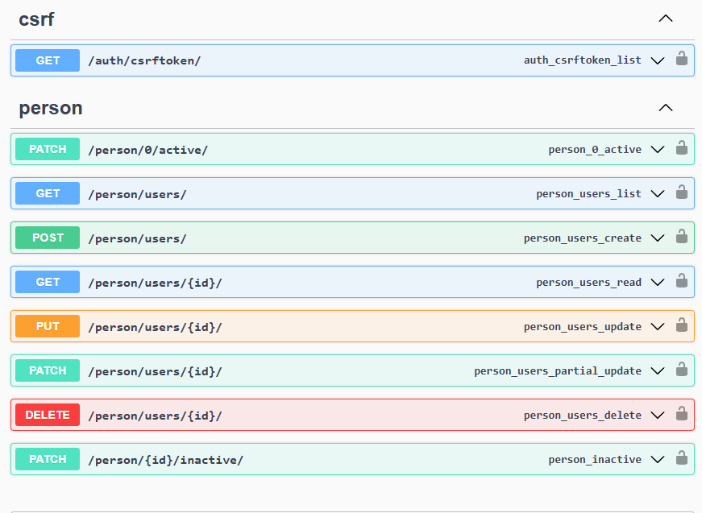
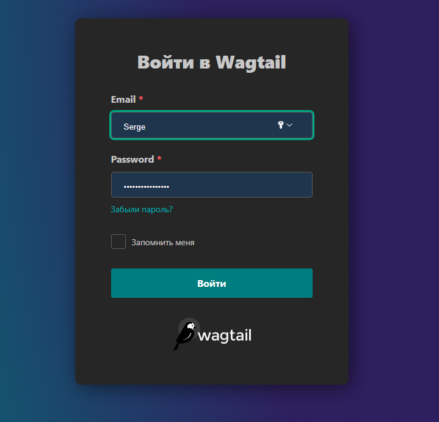

**02.11.2025**

В данный момент, необходимо:
- день для подключения бизнес части к API;
- пол дня создать "красивый" `README.md`;
- ещё день или два для - покрыть тестами;
- и день для страховки. 
Всего 5 дней дополнительно . Если ответ - нет, то `README.md` подготовлю 03.11.2025\
**Note**: И если желаете, дайте время для подключения "`njinx`" создания "`docker`"-инструкций и "`github workflow`" файла, чтоб подкнять на сервере.  

Сделано для пользователя:
- разграничение прав на роли - "`staff`", "`admin`", "`user`", "`visitor`", "`superuser`" (разграничение использовется в работе с аккаунтом пользователя);
- "`login`" пользователя;
- "`logout`" пользователя;
- "`update`" данных пользователя;
- "`delete`" пользователя (ограничение доступа) через - сохранение данных и аккаунта.
- "`delete`" пользователя из базы данных;
- Создана логика для генерации "`JWT`" тоена с внесением данных пользователя;
- С "`JWT`" токеном работа всё время через "`Cookie`" 
- Идентификация пользователя.
- "`SWAGER`" и описание для визуальной раоты со списком API;
- "`SWAGER`" и описание для работы например через "`Postman`" API;
- предусмотрины настройки для подключения к Celery (*при желании дайте время для кеширования данных на Redis - чтоб снять нагрузку с сервера*); 
- предусмотрины настройки для подключения к Redis; 
- предусмотрины настройки для проведения аутентификации через email;
- создан api для CSRF токена;
- настроен CORS;
- настроены 4 версии базы данных. 2 локальные - разработка + тест и теже 2 для внешнего сервера.   
- предусмотрена возможность расшрения списка ролей (но  не прав). Новый роли могут принимать права (персонала) "`person/permissions.py:is_managerOrAdmin`";
- базовый вариант (от Django) таблицы "`User`" из базы данных изменён;
- подключен асинхронный сервер и код ориентирован на асинхронный вариант;

А так же созданы db:
- "`BaseModel`" - абстрактная;
- "`User`";
- "`BlackListModel`";
- "`BusinessElementModel`";
- "`RoleModel`" (таблица с правми ниже); 

## Таблица прав доступа для ролей:
**02.11.2025**

В данный момент, необходимо:
- день для подключения бизнес части к API;
- пол дня создать "красивый" `README.md`;
- ещё день или два для - покрыть тестами;
- и день для страховки. 
Всего 5 дней дополнительно . Если ответ - нет, то `README.md` подготовлю 03.11.2025\
**Note**: И если желаете, дайте время для подключения "`njinx`" создания "`docker`"-инструкций и "`github workflow`" файла, чтоб подкнять на сервере.  

Сделано для пользователя:
- разграничение прав на роли - "`staff`", "`admin`", "`user`", "`visitor`", "`superuser`" (разграничение использовется в работе с аккаунтом пользователя);
- "`login`" пользователя;
- "`logout`" пользователя;
- "`update`" данных пользователя;
- "`delete`" пользователя (ограничение доступа) через - сохранение данных и аккаунта.
- "`delete`" пользователя из базы данных;
- Создана логика для генерации "`JWT`" тоена с внесением данных пользователя;
- С "`JWT`" токеном работа всё время через "`Cookie`" 
- Идентификация пользователя.
- "`SWAGER`" и описание для визуальной раоты со списком API;
- "`SWAGER`" и описание для работы например через "`Postman`" API;
- предусмотрины настройки для подключения к Celery (*при желании дайте время для кеширования данных на Redis - чтоб снять нагрузку с сервера*); 
- предусмотрины настройки для подключения к Redis; 
- предусмотрины настройки для проведения аутентификации через email;
- создан api для CSRF токена;
- настроен CORS;
- настроены 4 версии базы данных. 2 локальные - разработка + тест и теже 2 для внешнего сервера.   
- предусмотрена возможность расшрения списка ролей (но  не прав). Новый роли могут принимать права (персонала) "`person/permissions.py:is_managerOrAdmin`";
- базовый вариант (от Django) таблицы "`User`" из базы данных изменён;
- подключен асинхронный сервер и код ориентирован на асинхронный вариант;

А так же созданы db:
- "`BaseModel`" - абстрактная;
- "`User`";
- "`BlackListModel`";
- "`BusinessElementModel`";
- "`RoleModel`" (таблица с правми ниже); 

## Таблица прав доступа для ролей:

| Роль | Чтение | Создание | Обновление | Удаление | Доступ к админке | Примечания |Кол-во в проекта|
|------|--------|----------|------------|----------|------------------|------------|------------|
| **visitor** | ❌ | ❌ | ❌ | ❌ | ❌ | Только анонимный доступ |не ограничивается|
| **user** | ✅ | ✅ | ❌ | ❌ | ❌ | Может создавать, но не может удалять |не ограничивается|
| **staff** | ✅ | ✅ | ✅ | ❌ | ✅ | Персонал, но без прав удаления |не ограничивается|
| **admin** | ✅ | ✅ | ✅ | ✅ | ✅ | Полные права кроме суперпользователя |до 4 (изменить в .evn)|
| **superuser** | ✅ | ✅ | ✅ | ✅ | ✅ | Полные права на всю систему |до 1|

## Swagger

Да ещё\
##  Админ панель настраивать? 

## Swagger

Да ещё\
##  Админ панель настраивать? 

