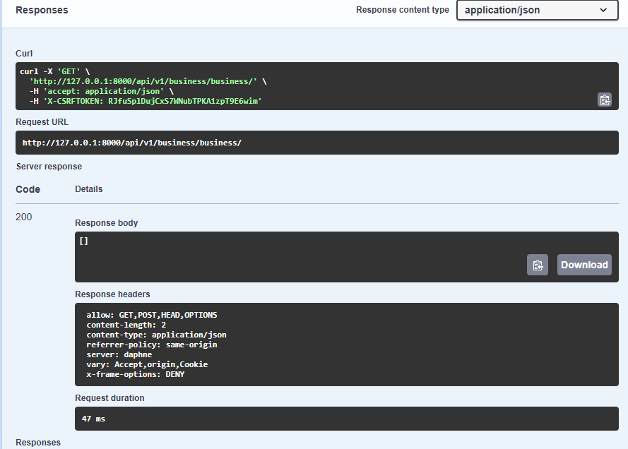

## Таблица прав доступа для ролей:

Сделано для пользователя:
- разграничение прав на роли - "`staff`", "`admin`", "`user`", "`visitor`", "`superuser`" (разграничение использовется в работе с аккаунтом пользователя);
- "`login`" пользователя;
- "`logout`" пользователя;
- "`update`" данных пользователя;
- "`delete`" пользователя (ограничение доступа) через - сохранение данных и аккаунта.
- "`delete`" пользователя из базы данных;
- Создана логика для генерации "`JWT`" тоена с внесением данных пользователя;
- С "`JWT`" токеном работа всё время через "`Cookie`" 
- Идентификация пользователя.
- "`SWAGER`" и описание для визуальной раоты со списком API;
- "`SWAGER`" и описание для работы например через "`Postman`" API;
- предусмотрины настройки для подключения к Celery (*при желании дайте время для кеширования данных на Redis - чтоб снять нагрузку с сервера*); 
- предусмотрины настройки для подключения к Redis; 
- предусмотрины настройки для проведения аутентификации через email;
- создан api для CSRF токена;
- настроен CORS;
- настроены 4 версии базы данных. 2 локальные - разработка + тест и теже 2 для внешнего сервера.   
- предусмотрена возможность расшрения списка ролей (но  не прав). Новый роли могут принимать права (персонала) "`person/permissions.py:is_managerOrAdmin`";
- базовый вариант (от Django) таблицы "`User`" из базы данных изменён;
- подключен асинхронный сервер и код ориентирован на асинхронный вариант;


А так же созданы db:
- "`BaseModel`" - абстрактная;
- "`User`";
- "`BlackListModel`";
- "`BusinessElementModel`";
- "`RoleModel`" (таблица с правми ниже); 

---

## Таблица прав доступа для ролей:

| Роль | Чтение | Создание | Обновление | Удаление | Доступ к админке | Примечания |Кол-во в проекта|
|------|--------|----------|------------|----------|------------------|------------|------------|
| **visitor** | ❌ | ❌ | ❌ | ❌ | ❌ | Только анонимный доступ |не ограничивается|
| **user** | ✅ | ✅ | ❌ | ❌ | ❌ | Может создавать, но не может удалять |не ограничивается|
| **staff** | ✅ | ✅ | ✅ | ❌ | ✅ | Персонал, но без прав удаления |не ограничивается|
| **admin** | ✅ | ✅ | ✅ | ✅ | ✅ | Полные права кроме суперпользователя |до 4 (изменить в .evn)|
| **superuser** | ✅ | ✅ | ✅ | ✅ | ✅ | Полные права на всю систему |до 1|

### Business

Таблица [прав доступа](person/permissions.py) для BusinessViewSet:

| Роль | Чтение (list, retrieve) | Создание (create) | Обновление (update) | Удаление (destroy) | Доступ к админке | Примечания | Кол-во в проекте |
|------|------------------------|-------------------|-------------------|------------------|------------------|------------|------------------|
| **visitor** | ❌ | ❌ | ❌ | ❌ | ❌ | Анонимный доступ запрещен | не ограничивается |
| **user** | ✅ (только свои элементы) | ✅ (только свои элементы) | ✅ (только свои элементы) | ❌ | ❌ | Может читать/создавать/обновлять только свои элементы через `is_owner` | не ограничивается |
| **staff** | ✅ | ✅ | ✅ | ❌ | ✅ | Может читать все, создавать/обновлять, но не удалять | не ограничивается |
| **admin** | ✅ | ✅ | ✅ | ✅ | ✅ | Полные права на все операции | до 4 (изменить в .env) |
| **superuser** | ✅ | ✅ | ✅ | ✅ | ✅ | Полные права на всю систему через `is_all` | до 1 |

**Детализация прав по методам:**

**CREATE:**
- "`is_managerOrAdmin(request)`" - менеджеры и администраторы
- "`is_create(request)`" - пользователи из группы "User_group"
- Также создатель элемента автоматически получает доступ к нему через AccessRolesModel

**LIST:**
- "`is_managerOrAdmin(request)`" - только менеджеры и администраторы
- Пользователи могут видеть только свои элементы через "`retrieve`" метод

**RETRIEVE (получение одного элемента):**
- "`is_managerOrAdmin(request)`" - менеджеры и администраторы
- "`is_owner(request, u)`" - владельцы элемента (создатели)

**UPDATE:**
- "`is_managerOrAdmin(request)`" - менеджеры и администраторы
- "`is_owner(request, u)`" - владельцы элемента

**DESTROY:**
- "`is_managerOrAdmin(request)`" - только менеджеры и администраторы

**Общие требования:**
- Активный аккаунт ("`is_active(request)`") требуется для всех операций
- Анонимный доступ запрещен для всех операций
- "`Superuser`" имеет полный доступ через "`is_all()`" проверку

## business
- НЕ зарегистрированный не имеет ни какого доступа.
- зарегистрированный может создать запись в базе данных (по API "`/business/`") и править свою же запсиь.
**Note**: Более [подробно про доступ](#таблица-прав-доступа-для-ролей),
- получить  список business-записей из базы данных может только персонал;

*Загрузка списка business-записей проходит в 50 страниц (с учётом пагинации).*

--- 
## Commands

```
py manage.py createsuperuser # - Создать пользователя
py manage.py makemigrations # - Создать миграции для новых можелей db
py manage.py migrate        # - Применить миграции к db
py manage.py showmigrations # - Вывести список миграций
py manage.py migrate <app_name> zero # - Откатиться до определенной миграции
py manage.py migrate <app_name> <migration name> # - Отменить все миграции
py manage.py collectstatic
py manage.py runserver
daphne project.asgi:application # - mode: develop & poduction
git clone <url_repo.git > # - Клонировать репозиторий 
git log --all --oneline --graph --decorate --date=format:'%Y-%m-%d %H:%M:%S' --pretty=format:'%C(yellow)%h%C(auto)%d %C(white)%cd%Creset %s' # - история развития проекта

```

### Note:
"`py manage.py collectstatic --clear --noinput`" Запускать после каждого измения статик файлов.
*"`--clear`"* - удаляет старые файлы. *"`--noinput`"* - если не хотите время тратить на комментарии после запуска команды. \
- "`makemigrations`" создать файлы миграции в db;
- "`migrate`" - изменить структуру [базы данных](img/wink_db.png);
- "`runserver`" - запускаем локальный сервер "`daphne`" для разработки.   

----

---
## URL 
### Локальный
* "`admin/`"; Старая версия
* "`cms/`"; Новая версия
* "`swagger/`" API загруска читаемой инструкции;
* "`redoc/`" API - возможно скачать для Postman;
* "`swagger<format>/`".
* 
### Swagger
||||
|:-----|:-----|:-----|
||||

### csrf
 - "`GET {{url}}/csrftoken/`" - получить CSRF-token;

### business
- "`POST`" "`{{url}}/business/order/`" - создать бизнес запись
- "`GET`"`{{url}}/business/order/`" - получить список бизнес записей
- "`GET`" "`{{url}}/business/order/{id}/`" получить получить одну запись
- "`PUT`" "`{{url}}/business/order/{id}/`" обновить всю сроку записи
- "`PATCH`" "`{{url}}/business/order/{id}/`" обновить запись частично
- "`DELETE`" "`{{url}}/business/order/{id}/`" удалить запись

### user
- "`GET`" "`{{url}}/person/users/`" получить список пользователй
- "`POST`" "`{{url}}/person/users/`" создать пользователя
- "`GET`" "`{{url}}/person/users/{id}/`" получить данные одного пользователя
- "`PUT`" "`{{url}}/person/users/{id}/`"  обновить всю запись пользователя
- "`PATCH`" "`{{url}}/person/users/{id}/`" обновить частично запись пользователя
- "`DELETE`" "`{{url}}/person/users/{id}/`" удалить запись пользователя
- "`PATCH`" "`{{url}}/person/0/active/`" авторизация/login
- "`PATCH`" "`/person/{id}/inactive/`" logout

## Дерево проекта

```text
root
├──.git/
├──.github/
│       └──workflows/*
│           └──*.yml
├──collectstatic/
├──media/
├──business/
│   └──*.py
├──person/
│   ├──views_api/
│   │   └──*.py
│   ├──jwt/
│   │   └──*.py 
│   ├──migrations/
│   │   └──*.py 
│   ├──models_person/
│   │   └──*.py
│   └──*.py
├──img/
│   └──*.png
├──project/
│   └──*.py
├──static/
│   ├──scripts/
│   |   └──*.js
│   └──styles/
│       └──*.css
├──templates/
|   └──*.html
├──.editorconfig
├──.env
├──.flake8
├──.gitignore
├──swagger.json
├──.pre-commit-config.yaml
├──.pylintrc
├──logs.py
├──manage.py
├──pyproject.toml
├──pytest.ini
├──swagger.json
├──README.md
├──requirements.txt
```
## .ENV

```text
#PYTHONPATH=E:\OpenServer\domains\hakaton\wink-hakaton\backend
SECRET_KEY_DJ= < sekret_key_of_your_django >
DJANGO_SETTINGS_MODULE=project.settings

IS_DEBUG=1 # 1 this is true or 0 it is false  
IS_ADMIN=4 < max_quantity_from_admin_user >
IS_SUPERUSER=1 < max_quantity_from_superuser_user >

# app
APP_PROTOCOL=http
APP_HOST=127.0.0.1
APP_HOST_REMOTE= <remote_host_ip >
APP_PORT=< project_port >
APP_TIME_ZONE=Asia/Krasnoyarsk

# Redis
REDIS_HOST=redis
DB_TO_RADIS_PORT=6380
DB_TO_RADIS_HOST=< project_redis_port>
DB_TO_RADIS_CACHE_USERS=1

# db
POSTGRES_DB= < db_name > 
POSTGRES_USER= < db_user >
POSTGRES_HOST= < host_IP >
POSTGRES_PORT=5432
POSTGRES_PASSWORD= < db_password >
DB_ENGINE=django.db.backends.postgresql

TEST_DB_NAME= < test_db_name >
TEST_DB_USER= < test_db_user >
TEST_DB_PASSWORD= <test_db_password >


DATABASE_ENGINE_LOCAL=django.db.backends.sqlite3
DATABASE_LOCAL=truckdriver_db.sqlite3

JWT_ACCESS_TOKEN_LIFETIME_MINUTES=5
JWT_REFFRESH_TOKEN_LIFETIME_DAYS=10


# Development mode
DJANGO_ENV=development
## or test
#DJANGO_ENV=testing

## or prodo
#DJANGO_ENV=production


# Email Service
SMTP_HOST=smtp.yandex.ru
SMTP_USER= <email@in_provader.domen>
SMTP_PORT=465
SMTP_PASS= <password_from_SMTP_USER>


```
----

|                      |                               |                           |
|:---------------------|:------------------------------|:--------------------------|
| async "`Django`"           | "`wagtail`"                   | "`PostgreSQL` or "`ASQLite`" |
| "`asincio`"              | "`adrf`"                      | "`psycopg2`"|


----

## 

**Note**: И если желаете:
- настрою "`njinx`", "`docker`"-инструкций и "`github workflow`" файла, чтоб подкнять на сервере.
- покрою тестами
