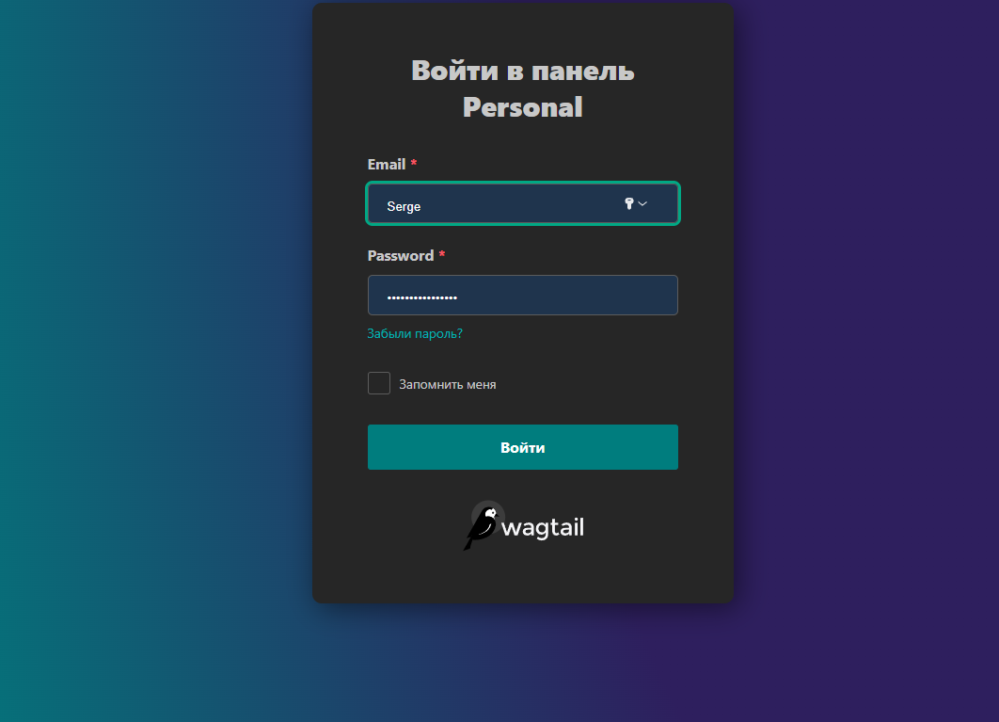
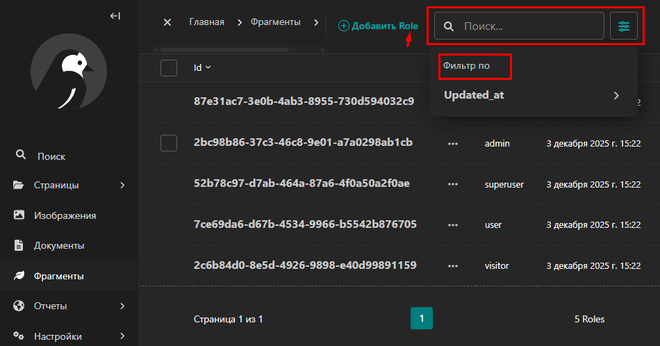
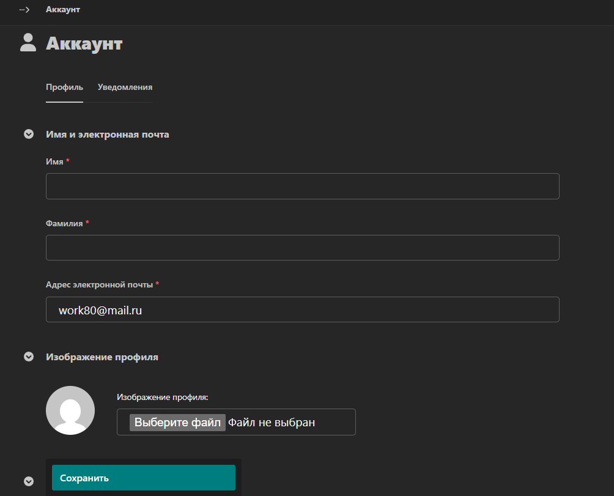
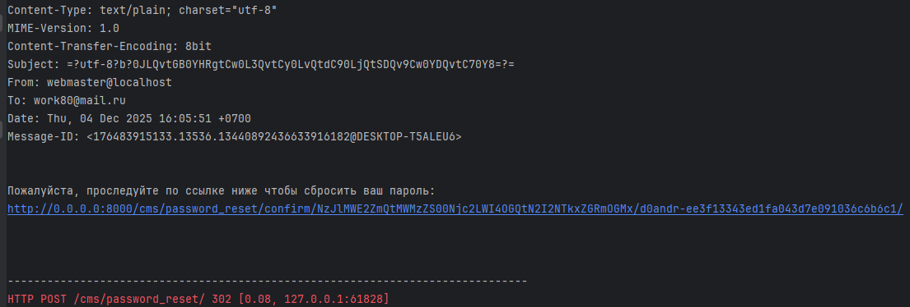
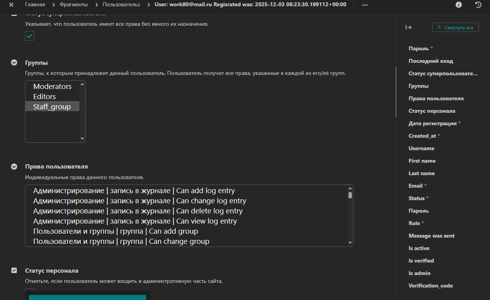

[README_RUS](./README.md)

## Access table of role

What did i make for users:
- permissions & roles were separeted by: - "`staff`", "`admin`", "`user`", "`visitor`", "`superuser`";
- "`login`" function of authorisation;
- "`logout`" function of logout;
- "`update`" updating of a user data it is a PUT & PATCH;
- "`delete`" this of user (access restriction) But. user's data should not remove from the db.   
- "`delete`" this function of a user removing. The user's account can remove only an admin;
- logic was created  where generate JWT's token;
- "`Cookie`" for  work with a JWT's token;
- Index of user is type of string.
- "`SWAGER`" и описание для визуальной раоты со списком API;
- API file for the "`Postman`";
- I made settings for connect to the Celery; 
- and was made the settings for connect into the Redis; 
- was made setting for authentication through email;
- created was - api for CSRF's token;
- was configured the CORS;
- The four database was configured. It is two for work on local server  - development + test and the two db  for work on out server;
- I expected what roles will be expanded and made dynamic;
- New roles can get the permissions."`person/permissions.py:is_managerOrAdmin`";
- basis user's table from django was changed to the new configuration;
- Daphne server was included.


And else:
- "`BaseModel`" - abstract;
- "`User`";
- "`BlackListModel`";
- "`BusinessElementModel`";
- "`RoleModel`" (permissions is below); 

---

## Table of permissions for roles 

| Name of role| Read | Create | Updated | Delete | Allows access | Note |Quantity in project|
|---------------|--------|----------|------------|----------|------------------|------------|------------|
| **visitor**   | ❌ | ❌ | ❌ | ❌ | ❌ | Access only how anonymous |without restrictions |
| **user**      | ✅ | ✅ | ❌ | ❌ | ❌ | They can create line but doesn't remove |without restrictions|
| **staff**     | ✅ | ✅ | ✅ | ❌ | ✅ | managers can't delete  |without restrictions|
| **admin**     | ✅ | ✅ | ✅ | ✅ | ✅ | allows all access |max quantity it's four (it's can change in .evn)|
| **superuser** | ✅ | ✅ | ✅ | ✅ | ✅ | allows all access |only one|

### Business

Table [access](person/permissions.py) for "`BusinessViewSet`":

| Роль | Чтение (list, retrieve) | Создание (create) | Обновление (update) | Удаление (destroy) | Доступ к админке | Примечания | Кол-во в проекте |
|------|------------------------|-------------------|-------------------|------------------|------------------|------------|------------------|
| **visitor** | ❌ | ❌ | ❌ | ❌ | ❌ | Anonymous is access close | doesn't limited |
| **user** | ✅ (только свои элементы) | ✅ (only own element) | ✅ (only own element) | ❌ | ❌ | read/create/update through `is_owner` | doesn't restrictions |
| **staff** | ✅ | ✅ | ✅ | ❌ | ✅ | read/create/updated | doesn't restrictions |
| **admin** | ✅ | ✅ | ✅ | ✅ | ✅ | full access | before four |
| **superuser** | ✅ | ✅ | ✅ | ✅ | ✅ | full access through the`is_all` | before 1 |

**Details of methods:**

**CREATE:**
- "`is_managerOrAdmin(request)`" - the managers & admins
- "`is_create(request)`" - users from the group "`User_group`"
- user who creates a business element  will receive access to it through the "`AccessRolesModel`"

**LIST:**
- "`is_managerOrAdmin(request)`" - only managers and admins
- Users can see only him self element. It's through  the method "`retrieve`"

**RETRIEVE (receive only one element):**
- "`is_managerOrAdmin(request)`" - managers and admins
- "`is_owner(request, u)`" - author of element

**UPDATE:**
- "`is_managerOrAdmin(request)`" - managers & admins
- "`is_owner(request, u)`" - if him would own element 

**DESTROY:**
- "`is_managerOrAdmin(request)`" - only managers & admins

**Total requirements:**
- is_active ("`is_active(request)`") requirement for all transactions.
- for anonymous the access is closed
- "`Superuser`" full access "`is_all()`" 

## business
- If user didn't registrate it means what user doesn't have access;
- If user was registered, this means his can create a database line (по API "`/business/`")  and will change it.
**Note**: and more [about permisions](#table-of-permissions-for-roles),
- get the business list from the db only if user is manager of admin.

--- 
## Commands

```
py manage.py createsuperuser # - Created of superuser
py manage.py makemigrations # - Create new mirates
py manage.py migrate        # - run migrate
py manage.py showmigrations # - show the migrate list
py manage.py migrate <app_name> zero # - return to the zero migrate
py manage.py migrate <app_name> <migration name> # - cancel all mirates
py manage.py collectstatic
py manage.py runserver
daphne project.asgi:application # - mode: develop & poduction
git clone <url_repo.git > # - clone repo. 
git log --all --oneline --graph --decorate --date=format:'%Y-%m-%d %H:%M:%S' --pretty=format:'%C(yellow)%h%C(auto)%d %C(white)%cd%Creset %s' # - история развития проекта

```

### Note:
"`py manage.py collectstatic --clear --noinput`" run after change the static files.
*"`--clear`"* - it for remove all files from the collectstatic. *"`--noinput`"* - if you doesn't want to make the comments. \
- "`makemigrations`" it for create new the migrate files;
- "`migrate`";
- "`runserver`" - run the local server "`daphne`" for development.   

----

---
## URL 
### Local
* "`admin/`"; old version the admin page  
* "`cms/`"; new version the admin page
* "`swagger/`" API ;
* "`redoc/`" API;
* "`swagger<format>/`".
* 
### Swagger
||||
|:-----|:-----|:-----|
||||

### csrf
 - "`GET {{url}}/csrftoken/`" - получить CSRF-token;

### business
- "`POST`" "`{{url}}/business/order/`" - create new a business line in database;
- "`GET`"`{{url}}/business/order/`" - get full list (business lines) from the db;
- "`GET`" "`{{url}}/business/order/{id}/`" get one line from database;
- "`PUT`" "`{{url}}/business/order/{id}/`"  is the full update for the one line;
- "`PATCH`" "`{{url}}/business/order/{id}/`" it has not update full/complete for the one line;   
- "`DELETE`" "`{{url}}/business/order/{id}/`" delete the one line.

### user
- "`GET`" "`{{url}}/person/users/`" get full scroll of users;
- "`POST`" "`{{url}}/person/users/`" create the one user;
- "`GET`" "`{{url}}/person/users/{id}/`" load data for of the one user;
- "`PUT`" "`{{url}}/person/users/{id}/`"  this api for update all the user data;
- "`PATCH`" "`{{url}}/person/users/{id}/`" this update does not complete in the user data;   
- "`DELETE`" "`{{url}}/person/users/{id}/`" delete of user;
- "`PATCH`" "`{{url}}/person/0/active/`" login;
- "`PATCH`" "`/person/{id}/inactive/`" logout.

## Tree of project

```text
root
├──.git/
├──.github/
│       └──workflows/*
│           └──*.yml
├──collectstatic/
├──media/
├──business/
│   └──*.py
├──person/
│   ├──views_api/
│   │   └──*.py
│   ├──jwt/
│   │   └──*.py 
│   ├──migrations/
│   │   └──*.py 
│   ├──models_person/
│   │   └──*.py
│   └──*.py
├──img/
│   └──*.png
├──project/
│   └──*.py
├──static/
│   ├──scripts/
│   |   └──*.js
│   └──styles/
│       └──*.css
├──templates/
|   └──*.html
├──.editorconfig
├──.env
├──.flake8
├──.gitignore
├──swagger.json
├──.pre-commit-config.yaml
├──.pylintrc
├──logs.py
├──manage.py
├──pyproject.toml
├──pytest.ini
├──swagger.json
├──README.md
├──requirements.txt
```
## .ENV

```text
#PYTHONPATH=E:\OpenServer\domains\hakaton\wink-hakaton\backend
SECRET_KEY_DJ= < sekret_key_of_your_django >
DJANGO_SETTINGS_MODULE=project.settings

IS_DEBUG=1 # 1 this is true or 0 it is false  
IS_ADMIN=4 < max_quantity_from_admin_user >
IS_SUPERUSER=1 < max_quantity_from_superuser_user >

# app
APP_PROTOCOL=http
APP_HOST=127.0.0.1
APP_HOST_REMOTE= <remote_host_ip >
APP_PORT=< project_port >
APP_TIME_ZONE=Asia/Krasnoyarsk

# Redis
REDIS_HOST=redis
DB_TO_RADIS_PORT=6380
DB_TO_RADIS_HOST=< project_redis_port>
DB_TO_RADIS_CACHE_USERS=1

# db
POSTGRES_DB= < db_name > 
POSTGRES_USER= < db_user >
POSTGRES_HOST= < host_IP >
POSTGRES_PORT=5432
POSTGRES_PASSWORD= < db_password >
DB_ENGINE=django.db.backends.postgresql

TEST_DB_NAME= < test_db_name >
TEST_DB_USER= < test_db_user >
TEST_DB_PASSWORD= <test_db_password >


DATABASE_ENGINE_LOCAL=django.db.backends.sqlite3
DATABASE_LOCAL=truckdriver_db.sqlite3

JWT_ACCESS_TOKEN_LIFETIME_MINUTES=5
JWT_REFFRESH_TOKEN_LIFETIME_DAYS=10


# Development mode
DJANGO_ENV=development
## or test
#DJANGO_ENV=testing

## or prodo
#DJANGO_ENV=production


# Email Service
SMTP_HOST=smtp.yandex.ru
SMTP_USER= <email@in_provader.domen>
SMTP_PORT=465
SMTP_PASS= <password_from_SMTP_USER>


```
----

|                      |                               |                           |
|:---------------------|:------------------------------|:--------------------------|
| async "`Django`"           | "`wagtail`"                   | "`PostgreSQL` or "`ASQLite`" |
|            | "`adrf`"                      | "`psycopg2`"|


----

## Admin
**Note**: make a click

|**Admin form - login**||**Admin page**||**Role of user**|
|:----|:----|:----|:----|:----|
|[](img/admin_form.png)||[](img/admin.png)||[](img/admin_role.png)|
||||||
|**Account**||**Business**||**Postman of letter**|
|[](img/account.png)||[](img/business_admi_element.png)||**[](img/email.png)**|
||||||
|**Permission of user**|||||
|[](img/user_Admin.png)|||||


